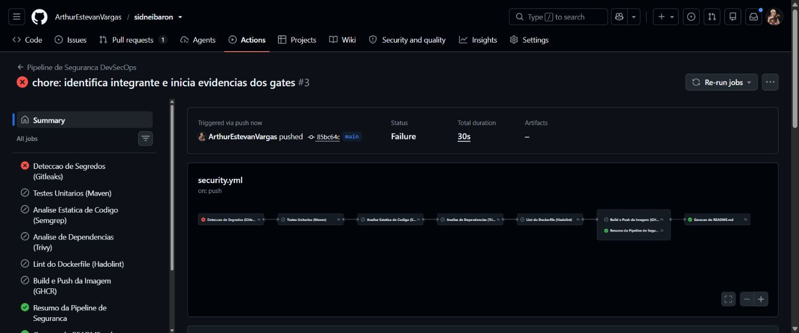
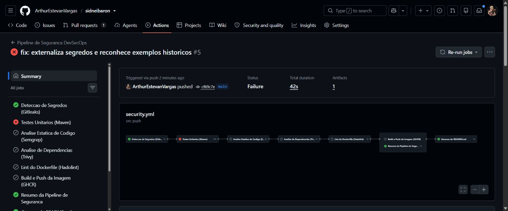
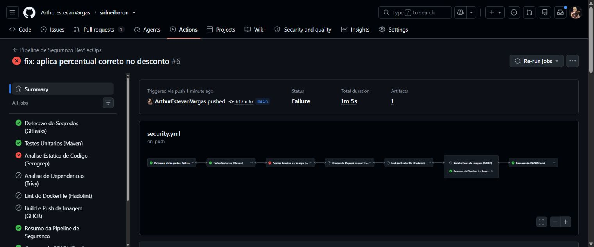
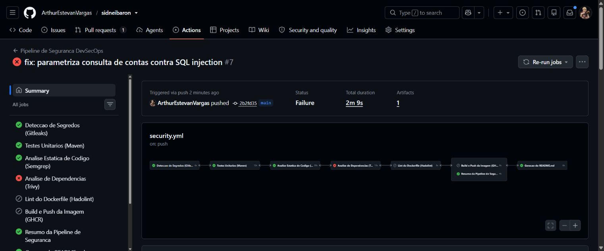
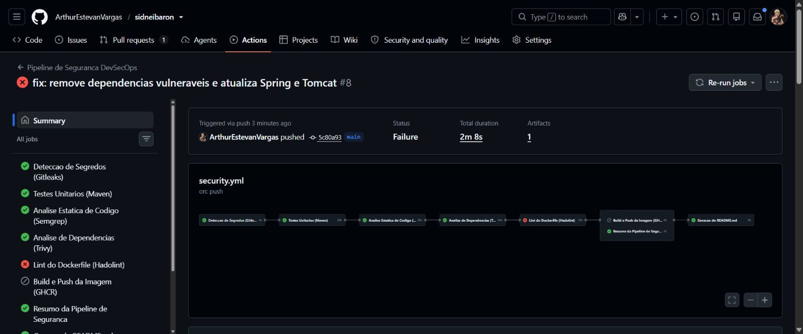
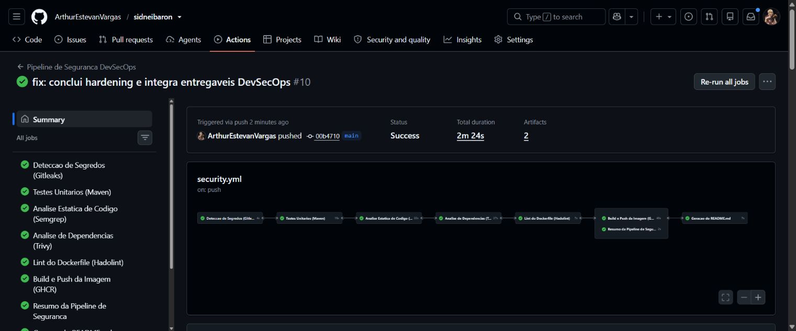
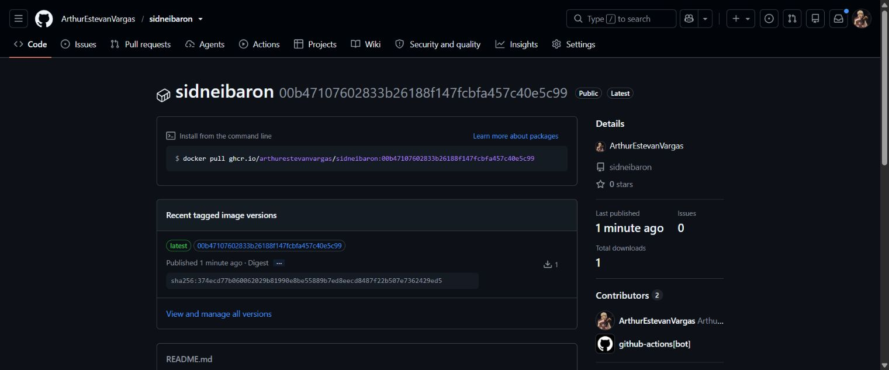

# Entrega da atividade DevSecOps

Integrante: Arthur Estevan Vargas.

Repositório: [ArthurEstevanVargas/sidneibaron](https://github.com/ArthurEstevanVargas/sidneibaron).

## Documentos

- [Pesquisa teórica, referências e esquema autoral](Pesquisa-ShiftLeft-ShiftRight.md).
- [Discussão final Shift Left / Shift Right](Discussao-final.md).
- [Execução local, configuração e limites do piloto](Operacao.md).

## Sequência de evidências

As correções foram aplicadas separadamente na main, preservando as falhas reais de cada gate. Os resumos mostram que a publicação foi pulada enquanto existia falha.

| Etapa | Evidência remota | Resultado observado |
|---|---|---|
| Segredos | [Execução 35667100501](https://github.com/ArthurEstevanVargas/sidneibaron/actions/runs/35667100501) | Duas ocorrências didáticas detectadas pelo Gitleaks |
| Testes | [Execução 35667187058](https://github.com/ArthurEstevanVargas/sidneibaron/actions/runs/35667187058) | Esperado 180, obtido 198 |
| SAST | [Execução 35667402370](https://github.com/ArthurEstevanVargas/sidneibaron/actions/runs/35667402370) | Duas regras apontaram SQL Injection |
| SCA | [Execução 35667534615](https://github.com/ArthurEstevanVargas/sidneibaron/actions/runs/35667534615) | Dependência Log4j Core vulnerável, incluindo CVE-2021-44228 |
| Dockerfile | [Execução 35667755536](https://github.com/ArthurEstevanVargas/sidneibaron/actions/runs/35667755536) | Hadolint bloqueou latest (DL3007) e root (DL3002) |

O [README automático](../README.md) registra o resultado do build, a execução correspondente, o nome da imagem, suas tags e o digest quando a publicação conclui. O nome da imagem segue o repositório existente: `ghcr.io/arthurestevanvargas/sidneibaron`.

Os sete screenshots estão publicados abaixo e na pasta [prints](prints/). Os logs de cada etapa estão disponíveis nas execuções do GitHub Actions vinculadas na tabela. O pacote local é apenas uma cópia complementar; os documentos e as evidências exigidos podem ser acessados neste repositório.

Branch Protection e multi-stage são opcionais no enunciado. A infraestrutura de banco do endpoint demonstrativo `/conta` não integra este piloto de pipeline; ver os limites em Operacao.md.

## Conclusão verificada em 21/09/2026

A [execução final 35668037863](https://github.com/ArthurEstevanVargas/sidneibaron/actions/runs/35668037863) concluiu os oito jobs com sucesso. A [PR #1](https://github.com/ArthurEstevanVargas/sidneibaron/pull/1) foi integrada à main após a sequência de correções.

A [imagem publicada em Packages](https://github.com/ArthurEstevanVargas/sidneibaron/pkgs/container/sidneibaron) é pública e possui as tags `latest` e `00b47107602833b26188f147fcbfa457c40e5c99`. Digest verificado: `sha256:374ecd77b060062029b81990e8be55889b7ed8eecd8487f22b507e7362429ed5`.

Foram coletados sete screenshots com Computer Use: cinco falhas, pipeline verde e imagem publicada. O README foi atualizado pelo próprio workflow com o nome do integrante e o resultado do build. Os documentos e prints estão publicados neste repositório; uma cópia complementar está no arquivo local `entrega-devsecops.zip`.
## Prints das execuções

### 1. Falha na detecção de segredos

### 2. Falha no teste de desconto

### 3. Falha na análise estática

### 4. Falha na análise de dependências

### 5. Falha no lint do Dockerfile

### 6. Pipeline final verde

### 7. Imagem publicada em Packages

